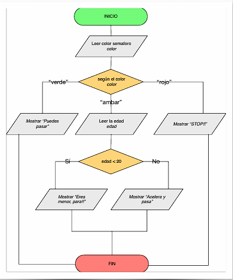
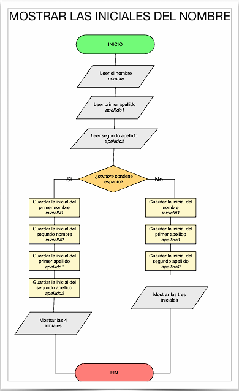
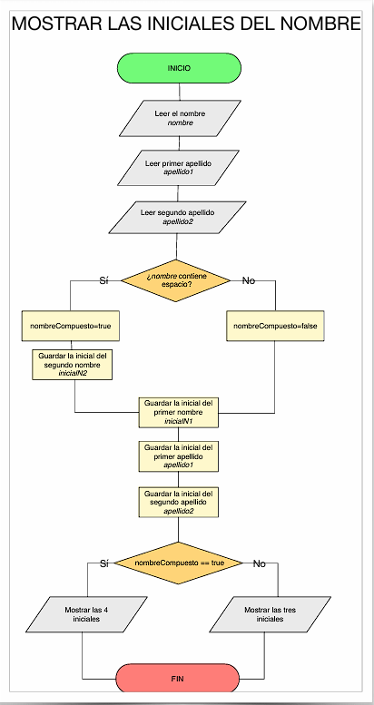

# Ejercicios de Estructuras Condicionales en C#

## Ejercicio 0 --- Número par o impar

Escribe un programa que lea un número e indique si es **par o impar**.\
**Opcional:** usa un booleano.

------------------------------------------------------------------------

## Ejercicio 1 --- Positivo, negativo o cero

Escribe un programa que te diga si un número entero es **positivo**,
**negativo** o **cero**.\
Hazlo de dos formas: - Usando tres `if { ... }` - Usando
`if { ... } else`

------------------------------------------------------------------------

## Ejercicio 2 --- Usuario y contraseña

Escribe un programa que pida un **nombre de usuario** y una
**contraseña**.\
Si se introduce *"root"* y *"toor"* se debe mostrar **"Has entrado al
sistema"**, si no un error.

Realízalo de tres formas: 1. Usando una condición doble\
2. Usando un `if...else` anidado\
3. Usando booleanos

------------------------------------------------------------------------

## Ejercicio 3 --- Nota de evaluación

Pide la nota de **tres exámenes**: examen1, examen2 y examen3.\
Pesos: - 30% - 30% - 40%

Muestra: - Nota final - Calificación: *SUSPENSO*, *SUFICIENTE*, *BIEN*,
*NOTABLE*, *SOBRESALIENTE*, *MATRÍCULA DE HONOR*

Haz la clasificación con `IF…ELSE IF….ELSE`.

**Opcional:** valida que la nota esté entre **0 y 10**.

------------------------------------------------------------------------

## Ejercicio 3bis --- Trabajo entregado

Extiende el ejercicio anterior preguntando si el alumno ha entregado el
**trabajo** (S/N).

-   Si **no** lo entregó → Nota = **4**\
-   Si **sí** lo entregó → Se calcula como en el ejercicio 3

**Opcional:** valida que las notas estén entre **0 y 10** usando una
condición doble con `OR`.

------------------------------------------------------------------------

## Ejercicio 4 --- Saludo según la hora

Pide por teclado la **hora del día (24H)** y muestra: - *BUENOS DÍAS*
(6--12) - *BUENAS TARDES* (12--21) - *BUENAS NOCHES* (21--6)

Ejemplo:\
Entrada → `22`\
Salida → *"Son las 22. BUENAS NOCHES!!"*

**Investiga** cómo obtener la hora actual automáticamente.

------------------------------------------------------------------------

## Ejercicio 5 --- Año bisiesto

Dado un año, indicar si es **bisiesto**.\
Un año es bisiesto si: - Es divisible entre **4** y no entre **100**\
- O es divisible entre **100** y **400**

------------------------------------------------------------------------

## Ejercicio SWITCH1 --- Día de la semana

Usando `switch`, escribe un programa que muestre el **día de la semana**
(LUNES, MARTES...) según el número introducido por teclado.

------------------------------------------------------------------------

## Ejercicio SWITCH2 --- Case múltiple

Pide un número del **1 al 7** y muestra si ese día hay **clase de
programación** o no.\
Debe usarse un `switch` con **case múltiple**.

------------------------------------------------------------------------

## Ejercicio SWITCH3 --- Semáforo

Usa un `switch` para indicar qué hacer según el **color del
semáforo**: - verde\
- rojo\
- ámbar

El `default` debe manejar colores incorrectos.

Luego modifica el ejercicio: - Si el color es **ámbar**: - Si la edad es
menor de 20 → debe parar\
- Si es mayor o igual → puede pasar

------------------------------------------------------------------------

## Ejercicio 6 --- Validación de fecha

Escribe un programa que pida **día, mes y año** y determine si la fecha
es **correcta**.\
El año debe estar entre **1900 y 2500**.\
Ten en cuenta los **años bisiestos**.

------------------------------------------------------------------------

## Ejercicio 7 --- Calculadora simple

Pide dos números y muestra un menú: 1. Sumar\
2. Restar\
3. Multiplicar\
4. Dividir\
5. Salir

Según la opción, muestra el resultado.

------------------------------------------------------------------------

## Ejercicio 8 --- Iniciales del nombre

Dado nombre y apellidos (nombre simple o compuesto), mostrar sus
**iniciales**.

Los datos se piden en varias líneas: 1. Nombre\
2. Apellido 1\
3. Apellido 2

Usa `nombre.indexOf(' ')` para detectar si el nombre es compuesto.

